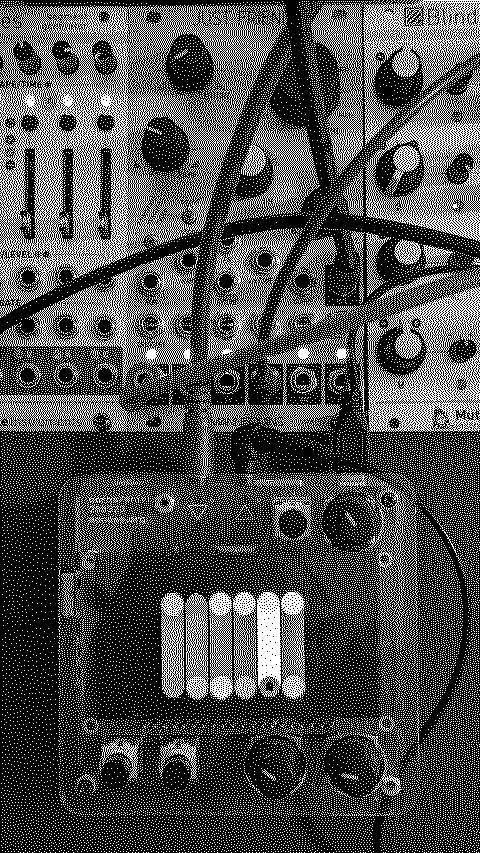

# divisive argument for just friends

Make disharmony and detunement by changing ratios.

Top is numerator, bottom is denominator.

# usage

Patch LFOs or sequencers to crow input 1 and input 2. At input 1, positive voltage select numerators of voices 1-6, and negative voltages the denominators of voices 1-6.

Both the numerator and denominator range from 1 to 127. One parameter *factor* sets kind of scaling. So this ranges from 127/1 to 1/127. Or something, I don't really understand it myself.

# note

Although the `cleanup` function does it's best, this will probably leave your jf confused, more precicely detuned. Either restart your jf with powercycle, or run `crow.ii.jf.retune(0, , 0, 0)`to reset to default tunings.
